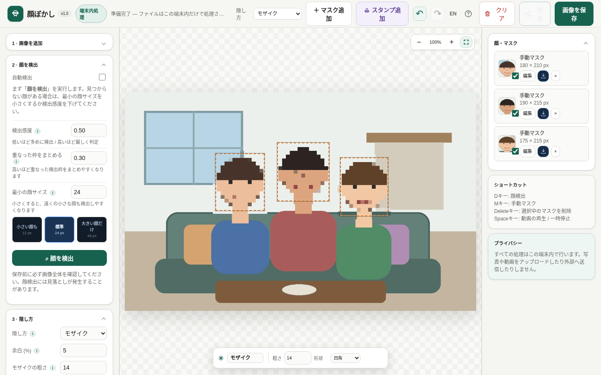

# Face Redactor

[](https://github.com/ttomohisa/htmlapps-face-redactor/actions/workflows/build-standalone.yml)
[](LICENSE)
[](https://ttomohisa.github.io/htmlapps-face-redactor/face-redactor.html)

[日本語版 README](README.ja.md)

A privacy-focused, single-HTML app for detecting and hiding faces in images directly in the browser. Pixelation, blur, solid fill, eye bars, emoji, custom images, and manual masks are all processed locally on your device.

## 🚀 Live demo

### [Open Face Redactor on GitHub Pages](https://ttomohisa.github.io/htmlapps-face-redactor/face-redactor.html)

GitHub Pages delivers the initial HTML. After it loads, face detection, masking, editing, and image export run locally in the browser. Images you select are not uploaded by the app.

[](https://ttomohisa.github.io/htmlapps-face-redactor/face-redactor.html)

## Features

- **Detect faces locally** — YuNet runs through ONNX Runtime Web without sending the selected image to a server.
- **Handle small and distant faces** — Switch the minimum face size between 12 / 24 / 48 px and tune detection confidence when needed.
- **Fix misses manually** — Draw, move, resize, enable/disable, and delete masks for faces or any other area you want to hide.
- **Choose how identities are hidden** — Pixelation, blur, solid fill, eye bars, emoji, and custom-image overlays are available.
- **Add lightweight annotations** — Place emoji, text, or image stamps, with undo and redo while editing.
- **Export without leaving the browser** — Save JPEG / PNG / WebP, adjust quality and scale, review the estimated output size, or share on supported devices.
- **Mobile-friendly editing** — Touch controls, zoom/pan, a compact sticky header, and a bottom action bar keep the main actions reachable on phones.
- **Single-HTML and privacy-focused** — ONNX Runtime Web and the YuNet model are embedded, and runtime network access is blocked with Content Security Policy.

> Face detection is not perfect. Always review the entire image before exporting and add manual masks when something was missed.

## Quick start

### Use the web demo

Just [open the demo](https://ttomohisa.github.io/htmlapps-face-redactor/face-redactor.html). No installation or account is required.

### Use the download file

1. Download [face-redactor.html](https://github.com/ttomohisa/htmlapps-face-redactor/blob/main/face-redactor.html).
2. Open it in a current Chromium-based browser, Firefox, or Safari.
3. Add an image and start editing. A local web server is not required for the checked-in standalone file.

### Build the standalone files

1. Download or clone this repository.
2. On Windows, run `build-standalone.bat`.
3. Open `dist/index.html`.
4. For the smaller portable wrapper, use `dist/index.self-extract.html`.

Python, Node.js, and a local web server are not required. The build uses Windows PowerShell.

A normal build creates:

```text
dist/
├─ index.html
├─ index.self-extract.html
├─ self-extract-manifest.json
└─ .nojekyll
```

## Usage

1. Add an image with the file picker, drag and drop, or clipboard paste.
2. Run **Find faces** and review the detected masks.
3. If small or distant faces are missed, lower **Smallest face** — try **12 px** first.
4. Adjust detection confidence if you want more candidates or fewer false positives.
5. Draw a manual mask over anything that still needs to be hidden.
6. Choose a redaction style and adjust its strength, padding, shape, or overlay.
7. Zoom in and inspect the whole image before exporting.
8. Save as JPEG / PNG / WebP, or use the system share sheet when supported.

### Smallest face

The **Smallest face** setting controls how small a face can be before the detector ignores it.

| Preset | Value | Best for |
| --- | ---: | --- |
| Small faces | 12 px | Group photos, crowds, distant faces |
| Standard | 24 px | Most photos |
| Large faces only | 48 px | Close-up portraits and faster detection |

A smaller value can find more distant faces, but may also increase processing time and false positives.

### Manual masks

Use **Add Mask** whenever automatic detection misses a face or when you want to hide something other than a face. Drag on the image to create a mask, then move or resize it directly on the canvas. Individual masks can also be enabled, disabled, or removed from the mask list.

### Keyboard shortcuts

| Shortcut | Action |
| --- | --- |
| `D` | Detect faces again |
| `M` | Toggle manual-mask mode |
| `Delete` | Delete the selected mask |
| `Space` | Play / pause video preview |

## Development and build layout

```text
.
├─ face-redactor.html               # Checked-in standalone app
├─ src/index.template.html          # Application source template
├─ assets/screenshot.png            # README screenshot
├─ app.config.json                  # App metadata and build settings
├─ dependencies.json                # External build dependencies (currently none)
├─ build-standalone.bat             # Windows build entry point
├─ build-standalone.ps1             # Standalone HTML builder
├─ scripts/
│  ├─ build-self-extract.ps1        # Self-extracting HTML builder
│  ├─ verify-self-extract.ps1       # Self-extract verification
│  └─ check-repository.ps1          # Repository/build validation
├─ dist/                            # Generated build output
└─ .github/workflows/
   └─ build-standalone.yml          # CI build validation
```

Keep `face-redactor.html` in sync with `src/index.template.html` when making source changes.

### Build

Run:

```bat
build-standalone.bat
```

or from PowerShell:

```powershell
.\build-standalone.ps1
```

To build only `dist/index.html` and skip the self-extracting version:

```powershell
.\build-standalone.ps1 -SkipSelfExtract
```

ONNX Runtime Web and the YuNet model are already embedded in the source HTML. The ONNX Runtime WASM payload is stored as gzip-compressed Base64 and decompressed locally at startup with the browser `DecompressionStream` API.

## Privacy and runtime network protection

The app is designed to keep selected media on the device.

- Selected images and videos are not uploaded by the app.
- ONNX Runtime Web and the YuNet face-detection model are embedded in the HTML.
- Content Security Policy includes `connect-src 'none'`, blocking runtime network connections.
- `wasm-unsafe-eval` / `unsafe-eval` are allowed only so ONNX Runtime Web can compile and execute its embedded WebAssembly backend; they do not allow network access.
- The self-extracting version restores the compressed app locally with the browser `DecompressionStream` API.

When hosted on a website, the browser still downloads the initial HTML. After that, selected media stays local unless you explicitly invoke a browser sharing feature.

## Limitations

- Face detection can miss faces or produce false positives, so manual review is required.
- Very small, occluded, blurred, rotated, or unusual-angle faces can be harder to detect.
- Lowering the smallest-face size can increase processing time and false positives.
- Video files can be loaded and previewed, but redacted video export is not available in the current version.
- Large images can consume substantial device memory and take longer on lower-powered devices.
- Web Share API availability depends on the browser and operating system.
- `index.self-extract.html` requires `DecompressionStream` support.

## Dependencies

| Library / model | Version | License | Purpose |
| --- | ---: | --- | --- |
| ONNX Runtime Web | 1.27.0 | MIT | Local neural-network inference in the browser |
| YuNet face detection model | OpenCV Zoo | MIT | Face detection |

See [THIRD_PARTY_NOTICES.md](THIRD_PARTY_NOTICES.md) for third-party license details.

## Contributing

Bug reports and feature proposals are welcome through GitHub Issues. When reporting a bug, include reproduction steps and browser/device information when possible.

## License

Copyright © 2026 ttomohisa

Licensed under the [MIT License](LICENSE).
